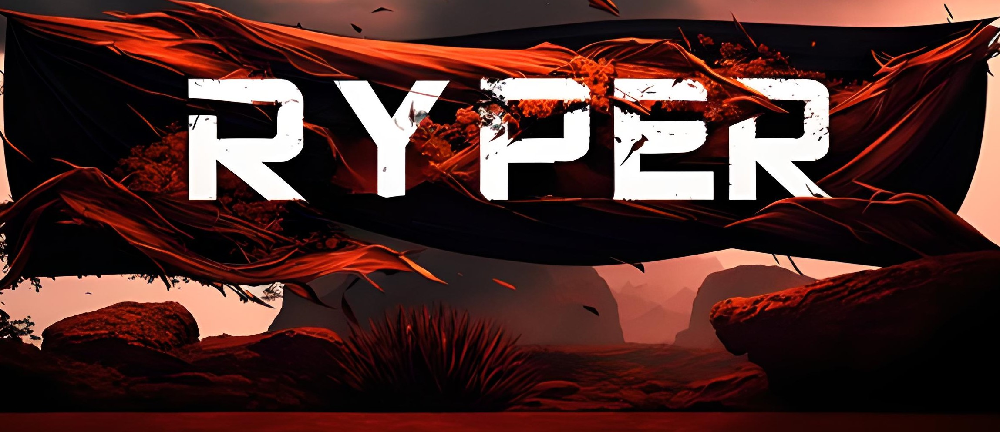

My name is Erick and I'm a junior front-end developer with experience using React. I currently reside in Mexico and have a degree in Systems Engineering. I am passionate about web application development and specialize in creating engaging and interactive user interfaces. My goal is to continue learning and growing professionally in the field of programming, always seeking to improve my skills and contribute to the success of the projects in which I participate. I am excited to be part of the technology industry and take advantage of the opportunities that present themselves to develop innovative solutions.

  

 
  <h3> Github Stats</h3>
  
   

 
 <h3>SKILLS</h3>
  

